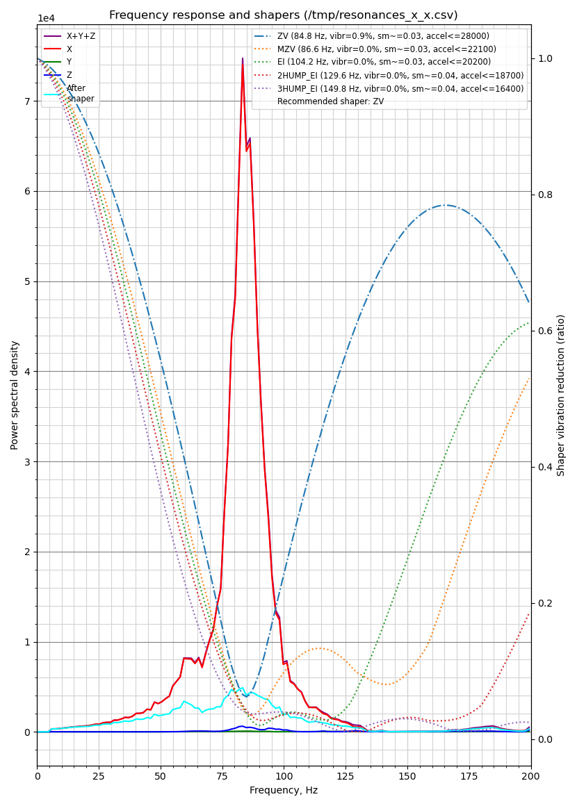
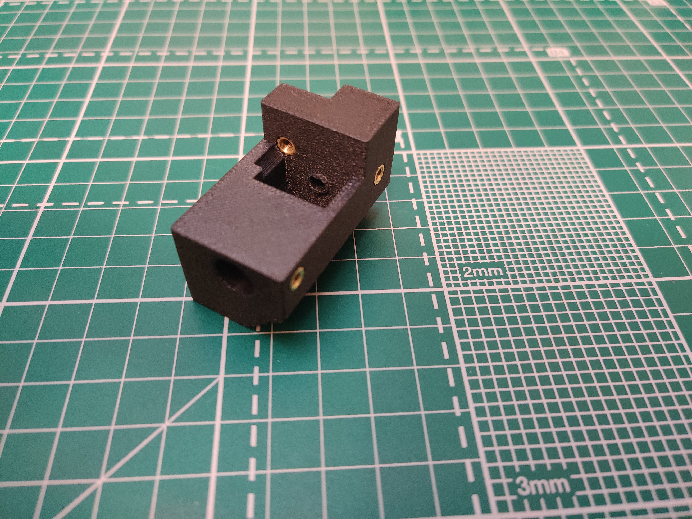

# Creality `K1 Max` XY Rails Mod

## Description

This mod fixes `K1 Max` quality issues, namely excessive ringing/echo. It also increases maximum accelerations.

**You must replace motor pulleys, 7.7mm belt does not fit stock pulleys. Alternatively, you can install non-stock motors.**

This mod uses `POWGE` 7.7 mm belt and corresponding idler pulleys.
You can use 6 mm belt with stock idlers if you add washers to compensate size differences (`POWGE` idlers have 10.4 mm height, [washers 0.2mm (Affiliate)](https://s.click.aliexpress.com/e/_Dn3ZZa3), [washers 0.3mm (Affiliate)](https://s.click.aliexpress.com/e/_DEptgHN)).

I replaced stock motor pulleys with 20T pulleys for 15mm belt (`rotation_distance` needs to be adjusted to `40` and `driver_SGTHRS` must be tuned `printer.cfg`). You will need a bearing puller to do that (some people use printed pullers e.g. [pulley puller](https://www.printables.com/model/515503-pulley-puller)), you have to be careful to avoid damage to motor shafts. If pulleys sit too tight you can use dremel and make cuts to relax pulleys. 

**You must use camera mount from this mod, it is 8mm lower than original.**

**This mod changes print area depending on options you select, beware.**

If you choose motor mounts option 2 - print area should remain the same.

This mod uses `MGN12` rails and `MGN12H` carriages for X and Y axis. All rails must be cut to have 375 mm between far left and far right holes, X axis rail has max length 410 mm (375 + 17.5x2 mm), Y axis rails - 385 mm (375 + 5x2 mm).

Recommended printing materials:

- Toolhead - PA/PA-CF or similar, ABS-GF
- Other parts - ABS-GF/ABS-CF

## Published

https://www.printables.com/model/913734-creality-k1-max-xy-rails-mod

https://makerworld.com/en/models/498602

https://www.thingiverse.com/thing:6667004

## License

All work in this repository falls under the Attribution-NonCommercial-ShareAlike 4.0 International (CC BY-NC-SA 4.0).

https://creativecommons.org/licenses/by-nc-sa/4.0/

### Notes

Partially this work is based on [D3vil-Design](https://github.com/D3vil-Design/K1-Hardware-Mods) and [Henlor](https://www.printables.com/@Henlor) designs.

## Photos

    
Front view

    

    
Top view

    

    
Motor mounts

    

    
Joints

    

    
Front idlers

    

    
Toolhead

    

## Input shaper graphs

Input shaper graphs for reinforced X axis (20x5mm aluminium sheet + 20x5mm carbon sheet).

**N.B. Results for Y axis will be worse (two peaks) when X axis is not reinforced or aluminum pipe 20x10x2 is used.**

    
X axis

    

    
Y axis

    

## VFA

**N.B.** I use 0.9 degree stepper motors - [17HS6401S 0.9 (Affiliate)](https://s.click.aliexpress.com/e/_DeegBeL), they are not ideal, hot and have lower torque then original, but I get less VFA.

I would recommend (quite expensive) LDO-42STH48-1684MAC 0.9 degree steppers, they have high torque, low temperature, do not need custom wiring.

    
eSun Silk PLA

    
    

    
eSun Mate PLA

    
    

# BOM

BOM contains affiliate links, this way you can support my work if you want.

## Front Idlers

    
Preview

    

### Left

[k1_front_idler_left.stl](/stl/k1_front_idler_left.stl)

| Item                            | Type      | Count | Link                                                    |
|---------------------------------|-----------|-------|---------------------------------------------------------|
| DIN 7991 Flat Head Cap Screw    | M4 30 mm  | 1     | [AliExpress](https://s.click.aliexpress.com/e/_DkdOkeJ) |
| DIN 7991 Flat Head Cap Screw    | M3 6 mm   | 4     | [AliExpress](https://s.click.aliexpress.com/e/_DmfmqJh) |
| DIN 912 Socket Head Cap Screw   | M3 16 mm  | 1     | [AliExpress](https://s.click.aliexpress.com/e/_DDrYqiJ) |
| POWGE GT2 No Teeth Idler Pulley | 7.7 mm    | 1     | [AliExpress](https://s.click.aliexpress.com/e/_DeapZjH) |
| Heat insert                     | M3 5x5 mm | 5     | [AliExpress](https://s.click.aliexpress.com/e/_DeBGks7) |

### Right

[k1_front_idler_right.stl](/stl/k1_front_idler_right.stl)

| Item                            | Type      | Count | Link                                                    |
|---------------------------------|-----------|-------|---------------------------------------------------------|
| DIN 7991 Flat Head Cap Screw    | M4 30 mm  | 1     | [AliExpress](https://s.click.aliexpress.com/e/_DkdOkeJ) |
| DIN 7991 Flat Head Cap Screw    | M3 6 mm   | 4     | [AliExpress](https://s.click.aliexpress.com/e/_DmfmqJh) |
| DIN 912 Socket Head Cap Screw   | M3 16 mm  | 1     | [AliExpress](https://s.click.aliexpress.com/e/_DDrYqiJ) |
| POWGE GT2 No Teeth Idler Pulley | 7.7 mm    | 1     | [AliExpress](https://s.click.aliexpress.com/e/_DeapZjH) |
| Heat insert                     | M3 5x5 mm | 5     | [AliExpress](https://s.click.aliexpress.com/e/_DeBGks7) |

## Camera

[k1_camera.stl](/stl/k1_camera.stl)

## Joints

    
Preview

    

### Left

[k1_joint_left.stl](/stl/k1_joint_left.stl)

| Item                            | Type      | Count | Link                                                    |
|---------------------------------|-----------|-------|---------------------------------------------------------|
| DIN 7991 Flat Head Cap Screw    | M4 30 mm  | 2     | [AliExpress](https://s.click.aliexpress.com/e/_DkdOkeJ) |
| Flat Thin Wafer Head Screw      | M3 6 mm   | 1     | [AliExpress](https://s.click.aliexpress.com/e/_DFHDPnH) |
| DIN 912 Socket Head Cap Screw   | M3 8 mm   | 3     | [AliExpress](https://s.click.aliexpress.com/e/_DDrYqiJ) |
| DIN 912 Socket Head Cap Screw   | M3 25 mm  | 1     | [AliExpress](https://s.click.aliexpress.com/e/_DDrYqiJ) |
| POWGE GT2 No Teeth Idler Pulley | 7.7 mm    | 2     | [AliExpress](https://s.click.aliexpress.com/e/_DeapZjH) |
| Heat insert                     | M3 5x5 mm | 1     | [AliExpress](https://s.click.aliexpress.com/e/_DeBGks7) |

### Right

[k1_joint_right.stl](/stl/k1_joint_right.stl)

| Item                            | Type      | Count | Link                                                    |
|---------------------------------|-----------|-------|---------------------------------------------------------|
| DIN 7991 Flat Head Cap Screw    | M4 30 mm  | 2     | [AliExpress](https://s.click.aliexpress.com/e/_DkdOkeJ) |
| Flat Thin Wafer Head Screw      | M3 6 mm   | 2     | [AliExpress](https://s.click.aliexpress.com/e/_DFHDPnH) |
| DIN 912 Socket Head Cap Screw   | M3 8 mm   | 2     | [AliExpress](https://s.click.aliexpress.com/e/_DDrYqiJ) |
| DIN 912 Socket Head Cap Screw   | M3 25 mm  | 1     | [AliExpress](https://s.click.aliexpress.com/e/_DDrYqiJ) |
| POWGE GT2 No Teeth Idler Pulley | 7.7 mm    | 2     | [AliExpress](https://s.click.aliexpress.com/e/_DeapZjH) |
| Heat insert                     | M3 5x5 mm | 1     | [AliExpress](https://s.click.aliexpress.com/e/_DeBGks7) |

## Rails mounts

You'll need at least 2 of these for each side.

    
Preview

    
    

### Left

[k1_rail_mount.stl](/stl/k1_rail_mount.stl)

| Item                            | Type      | Count | Link                                                    |
|---------------------------------|-----------|-------|---------------------------------------------------------|
| DIN 912 Socket Head Cap Screw   | M3 25 mm  | 1     | [AliExpress](https://s.click.aliexpress.com/e/_DDrYqiJ) |
| DIN 912 Socket Head Cap Screw   | M3 8 mm   | 2     | [AliExpress](https://s.click.aliexpress.com/e/_DDrYqiJ) |
| Heat insert                     | M3 5x5 mm | 2     | [AliExpress](https://s.click.aliexpress.com/e/_DeBGks7) |

### Right

[k1_rail_mount.stl](/stl/k1_rail_mount.stl)

| Item                          | Type      | Count | Link                                                    |
|-------------------------------|-----------|-------|---------------------------------------------------------|
| DIN 912 Socket Head Cap Screw | M3 25 mm  | 1     | [AliExpress](https://s.click.aliexpress.com/e/_DDrYqiJ) |
| DIN 912 Socket Head Cap Screw | M3 8 mm   | 2     | [AliExpress](https://s.click.aliexpress.com/e/_DDrYqiJ) |
| Heat insert                   | M3 5x5 mm | 2     | [AliExpress](https://s.click.aliexpress.com/e/_DeBGks7) |

## Motor Mounts - Option 1

Use this mounts to simplify build at the cost of reducing print area.

    
Preview

    

### Left

[k1_motor_mount_left.stl](/stl/k1_motor_mount_left.stl)

| Item                            | Type      | Count | Link                                                    |
|---------------------------------|-----------|-------|---------------------------------------------------------|
| DIN 7991 Flat Head Cap Screw    | M3 6 mm   | 4     | [AliExpress](https://s.click.aliexpress.com/e/_DmfmqJh) |
| DIN 912 Socket Head Cap Screw   | M3 6 mm   | 2     | [AliExpress](https://s.click.aliexpress.com/e/_DDrYqiJ) |
| DIN 912 Socket Head Cap Screw   | M3 16 mm  | 1     | [AliExpress](https://s.click.aliexpress.com/e/_DDrYqiJ) |
| Motor Pulley for 15mm belt      | 20T 5 mm  | 1     | [AliExpress](https://s.click.aliexpress.com/e/_opRGeML) |
| POWGE GT2 No Teeth Idler Pulley | 7.7 mm    | 2     | [AliExpress](https://s.click.aliexpress.com/e/_DeapZjH) |
| Heat insert                     | M3 5x5 mm | 6     | [AliExpress](https://s.click.aliexpress.com/e/_DeBGks7) |

### Right

[k1_motor_mount_right.stl](/stl/k1_motor_mount_right.stl)

| Item                            | Type      | Count | Link                                                    |
|---------------------------------|-----------|-------|---------------------------------------------------------|
| DIN 7991 Flat Head Cap Screw    | M3 6 mm   | 4     | [AliExpress](https://s.click.aliexpress.com/e/_DmfmqJh) |
| DIN 912 Socket Head Cap Screw   | M3 6 mm   | 2     | [AliExpress](https://s.click.aliexpress.com/e/_DDrYqiJ) |
| DIN 912 Socket Head Cap Screw   | M3 16 mm  | 1     | [AliExpress](https://s.click.aliexpress.com/e/_DDrYqiJ) |
| Motor Pulley for 15mm belt      | 20T 5 mm  | 1     | [AliExpress](https://s.click.aliexpress.com/e/_opRGeML) |
| POWGE GT2 No Teeth Idler Pulley | 7.7 mm    | 2     | [AliExpress](https://s.click.aliexpress.com/e/_DeapZjH) |
| Heat insert                     | M3 5x5 mm | 6     | [AliExpress](https://s.click.aliexpress.com/e/_DeBGks7) |

## Motor Mounts - Option 2

Use this mounts to preserve print area.

### Motor mount left (stock motors)

    
Preview

    

[k1_motor_mount_couplers_stock_left.stl](/stl/k1_motor_mount_couplers_stock_left.stl)

| Item                            | Type      | Count | Link                                                    |
|---------------------------------|-----------|-------|---------------------------------------------------------|
| DIN 7991 Flat Head Cap Screw    | M3 6 mm   | 4     | [AliExpress](https://s.click.aliexpress.com/e/_DmfmqJh) |
| DIN 912 Socket Head Cap Screw   | M3 6 mm   | 3     | [AliExpress](https://s.click.aliexpress.com/e/_DDrYqiJ) |
| DIN 912 Socket Head Cap Screw   | M3 16 mm  | 1     | [AliExpress](https://s.click.aliexpress.com/e/_DDrYqiJ) |
| Flat Thin Wafer Head Screw      | M3 6 mm   | 2     | [AliExpress](https://s.click.aliexpress.com/e/_DFHDPnH) |
| MF95ZZ Bearing                  |           | 2     | [AliExpress](https://s.click.aliexpress.com/e/_onsRFx9) |
| Double Diaphragm Coupler        | 20x30 5x5 | 1     | [AliExpress](https://s.click.aliexpress.com/e/_opH2rfl) |
| Shaft                           | 5x57 mm   | 1     | [AliExpress](https://s.click.aliexpress.com/e/_oDW10pH) |
| Motor Pulley for 15mm belt      | 20T 5 mm  | 1     | [AliExpress](https://s.click.aliexpress.com/e/_opRGeML) |
| POWGE GT2 No Teeth Idler Pulley | 7.7 mm    | 2     | [AliExpress](https://s.click.aliexpress.com/e/_DeapZjH) |
| Heat insert                     | M3 5x5 mm | 5     | [AliExpress](https://s.click.aliexpress.com/e/_DeBGks7) |
| Heat insert                     | M3 4x5 mm | 1     | [AliExpress](https://s.click.aliexpress.com/e/_DeBGks7) |

### Motor mount right (stock motors)

    
Preview

    

[k1_motor_mount_couplers_stock_right.stl](/stl/k1_motor_mount_couplers_stock_right.stl)

| Item                            | Type      | Count | Link                                                    |
|---------------------------------|-----------|-------|---------------------------------------------------------|
| DIN 7991 Flat Head Cap Screw    | M3 6 mm   | 4     | [AliExpress](https://s.click.aliexpress.com/e/_DmfmqJh) |
| DIN 912 Socket Head Cap Screw   | M3 6 mm   | 3     | [AliExpress](https://s.click.aliexpress.com/e/_DDrYqiJ) |
| DIN 912 Socket Head Cap Screw   | M3 16 mm  | 1     | [AliExpress](https://s.click.aliexpress.com/e/_DDrYqiJ) |
| Flat Thin Wafer Head Screw      | M3 6 mm   | 2     | [AliExpress](https://s.click.aliexpress.com/e/_DFHDPnH) |
| MF95ZZ Bearing                  |           | 2     | [AliExpress](https://s.click.aliexpress.com/e/_onsRFx9) |
| Double Diaphragm Coupler        | 20x30 5x5 | 1     | [AliExpress](https://s.click.aliexpress.com/e/_opH2rfl) |
| Shaft                           | 5x57 mm   | 1     | [AliExpress](https://s.click.aliexpress.com/e/_oDW10pH) |
| Motor Pulley for 15mm belt      | 20T 5 mm  | 1     | [AliExpress](https://s.click.aliexpress.com/e/_opRGeML) |
| POWGE GT2 No Teeth Idler Pulley | 7.7 mm    | 2     | [AliExpress](https://s.click.aliexpress.com/e/_DeapZjH) |
| Heat insert                     | M3 5x5 mm | 5     | [AliExpress](https://s.click.aliexpress.com/e/_DeBGks7) |
| Heat insert                     | M3 4x5 mm | 1     | [AliExpress](https://s.click.aliexpress.com/e/_DeBGks7) |

## Tensioners

    
Preview

    

### Left

[k1_tensioner_left.stl](/stl/k1_tensioner_left.stl)

| Item                            | Type        | Count | Link                                                    |
|---------------------------------|-------------|-------|---------------------------------------------------------|
| DIN 912 Socket Head Cap Screw   | M3 45 mm    | 1     | [AliExpress](https://s.click.aliexpress.com/e/_DCYZ5zD) |
| DIN 912 Socket Head Cap Screw   | M3 16 mm    | 2     | [AliExpress](https://s.click.aliexpress.com/e/_DDrYqiJ) |
| DIN 912 Socket Head Cap Screw   | M4 20 mm    | 1     | [AliExpress](https://s.click.aliexpress.com/e/_DEOTbEL) |
| POWGE GT2 No Teeth Idler Pulley | 7.7 mm      | 1     | [AliExpress](https://s.click.aliexpress.com/e/_DeapZjH) |
| Heat insert                     | M3 3x4.5 mm | 2     | [AliExpress](https://s.click.aliexpress.com/e/_DeBGks7) |

### Right

[k1_tensioner_right.stl](/stl/k1_tensioner_right.stl)

| Item                            | Type        | Count | Link                                                    |
|---------------------------------|-------------|-------|---------------------------------------------------------|
| DIN 912 Socket Head Cap Screw   | M3 45 mm    | 1     | [AliExpress](https://s.click.aliexpress.com/e/_DCYZ5zD) |
| DIN 912 Socket Head Cap Screw   | M3 16 mm    | 2     | [AliExpress](https://s.click.aliexpress.com/e/_DDrYqiJ) |
| DIN 912 Socket Head Cap Screw   | M4 20 mm    | 1     | [AliExpress](https://s.click.aliexpress.com/e/_DEOTbEL) |
| POWGE GT2 No Teeth Idler Pulley | 7.7 mm      | 1     | [AliExpress](https://s.click.aliexpress.com/e/_DeapZjH) |
| Heat insert                     | M3 3x4.5 mm | 2     | [AliExpress](https://s.click.aliexpress.com/e/_DeBGks7) |

## Toolhead and X axis

There are 2 options for X axis:

1. Rail only - use [k1_toolhead.stl](/stl/k1_toolhead.stl)
   
   MGN12 rail can be used on X axis without reinforcement, but it is not rigid enough.
   
   Bed mesh will likely be less accurate, input shaper graph for Y axis will have at least 2 peaks, there will be vibrations on Z axis.
   
   There is one benefit - you probably will have print area unchanged.

2. Rail mounted on 20x10 pipe or 20x5 carbon + 20x5 aluminium sheets - use [k1_toolhead_20x10.stl](/stl/k1_toolhead_20x10.stl)
   
   Print area will be reduced to 284 mm (Y axis). 

### Aluminium rectangular pipe on X axis

Use rail as drilling template, first make mark using 4 mm drill bit, then drill hole using 2.5 mm drill bit, then tap M3 thread.

    
Preview

    

| Item                          | Type           | Count | Link                                                    |
|-------------------------------|----------------|-------|---------------------------------------------------------|
| Aluminium rectangular pipe    | 20x10x2 500 mm | 1     | [AliExpress](https://s.click.aliexpress.com/e/_Defnblp) |
| DIN 912 Socket Head Cap Screw | M3 8 mm        | 7-14  | [AliExpress](https://s.click.aliexpress.com/e/_DDrYqiJ) |

### Aluminium and carbon sheet on X axis

Alternatively, you can use 20x5 mm aluminium sheet and 20x5 carbon sheet instead of 20x10 pipe:

    
Preview

    
    

| Item                          | Type        | Count | Link                                                    |
|-------------------------------|-------------|-------|---------------------------------------------------------|
| Aluminium sheet               | 20x5 500 mm | 1     | [AliExpress](https://s.click.aliexpress.com/e/_Dm5qHWj) |
| Carbon fiber sheet            | 20x5 500 mm | 1     | [AliExpress](https://s.click.aliexpress.com/e/_DBjpWrt) |
| DIN 912 Socket Head Cap Screw | M3 8 mm     | 7-14  | [AliExpress](https://s.click.aliexpress.com/e/_DDrYqiJ) |

### Toolhead

Both toolheads ([k1_toolhead.stl](/stl/k1_toolhead.stl) and [k1_toolhead_20x10.stl](/stl/k1_toolhead_20x10.stl)) use the same set of materials.

    
Preview

    

| Item                            | Type        | Count | Link                                                    |
|---------------------------------|-------------|-------|---------------------------------------------------------|
| Heat insert                     | M3 4.5x3 mm | 6     | [AliExpress](https://s.click.aliexpress.com/e/_DeBGks7) |
| Heat insert                     | M3 5x7 mm   | 3     | [AliExpress](https://s.click.aliexpress.com/e/_DeBGks7) |
| Heat insert                     | M3 5x5 mm   | 4     | [AliExpress](https://s.click.aliexpress.com/e/_DeBGks7) |
| Heat insert                     | M3 5x4 mm   | 2     | [AliExpress](https://s.click.aliexpress.com/e/_DeBGks7) |
| Heat insert                     | M2 3.5x3 mm | 2     | [AliExpress](https://s.click.aliexpress.com/e/_DeBGks7) |

## Other parts

7.7 mm belts increase max accelerations.

| Item              | Type   | Count | Link                                                    |
|-------------------|--------|-------|---------------------------------------------------------|
| POWGE GT2 belt    | 7.7 mm | 1     | [AliExpress](https://s.click.aliexpress.com/e/_DkK1xL9) |
| KGT MGN12H + rail | 400 mm | 2     | [AliExpress](https://s.click.aliexpress.com/e/_DljEcJZ) |
| KGT MGN12H + rail | 500 mm | 1     | [AliExpress](https://s.click.aliexpress.com/e/_DcIqeVl) |

## Tools (optional)

Things you might need, drill bits, taps.

| Item                | Type | Count | Link                                                    |
|---------------------|------|-------|---------------------------------------------------------|
| Hand Tap            | 3 mm | 1     | [AliExpress](https://s.click.aliexpress.com/e/_DEEnHLH) |
| Hand Tap Wrench     |      | 1     | [AliExpress](https://s.click.aliexpress.com/e/_DFq7575) |
| HSS Drill Bits Set  |      | 1     | [AliExpress](https://s.click.aliexpress.com/e/_Dmw4uhz) |